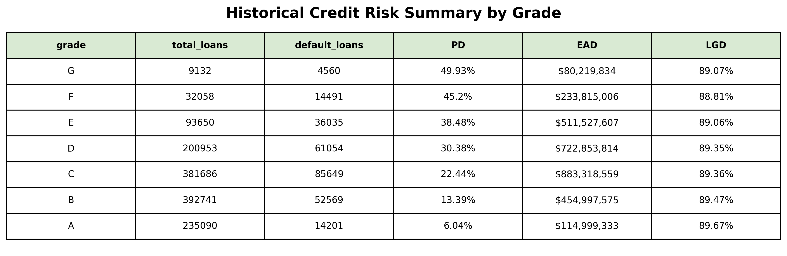
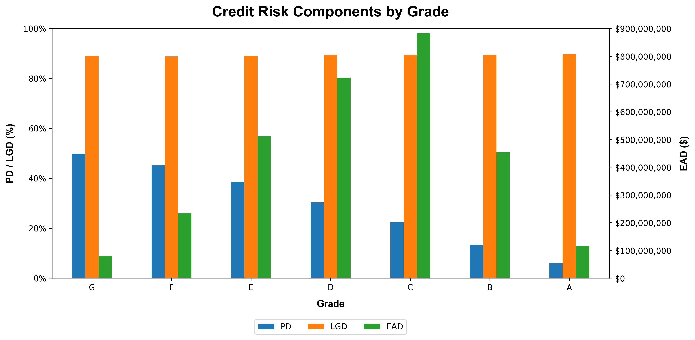

# LendingClub Loan Portfolio Analysis: Credit Risk, Returns, and Portfolio Concentration


## Overview
This analysis evaluates credit risk, loan performance, and portfolio concentration using over 2.2M loans from the LendingClub dataset (2007–2018). The focus is on approximately 1.3M finalized loans with `Fully Paid` or `Charged Off` status to measure realized portfolio outcomes.

A credit risk analysis is performed using Probability of Default (PD), Exposure at Default (EAD), and Loss Given Default (LGD) to evaluate observed default frequency, exposure at the time of default, and realized loss severity across credit grades. This analysis complements portfolio performance metrics by providing additional insight into credit risk differences across grades.

The analysis uses SQL for aggregation, Python for preprocessing and modeling, and Tableau for dashboard development to identify high-risk segments, evaluate risk-adjusted returns, and assess portfolio concentration.

### Key Objectives:
- Analyze portfolio default trends across origination cohorts
- Identify borrower segments contributing most to realized defaults
- Evaluate risk-adjusted returns across credit grades
- Measure portfolio concentration across loan purposes and geographic regions
- Analyze credit risk using PD, LGD, and EAD across credit grades  

---

## Business Questions

#### 1. Portfolio Health & Default Trends
How does loan performance vary across loan origination cohorts from 2007–2018, and what patterns emerge in portfolio credit risk over time?

#### 2. Default Contribution & Risk Distribution
Which grades contribute most to loan defaults, and how is risk distributed across subgrades and borrower segments?

#### 3. Risk vs. Return 
How does net return performance vary across grades relative to default risk?

#### 4. Portfolio Concentration & Diversification Risk
Is the portfolio heavily concentrated across specific borrower segments or geographic regions?

#### 5. Historical Credit Risk Analysis
How do observed credit risk characteristics vary across borrower grades, and what factors contribute to differences in default probability, exposure at default, and loss severity?

---

## Visual Dashboards & Analytics 

This analysis includes both Tableau dashboards and Python-generated credit risk analytics to provide a comprehensive view of portfolio performance.

### Tableau Dashboards

| Dashboard | Description | CSV Files | Preview |
|---|---|---|---|
| **Executive Portfolio Health Overview** | Funded volume distribution, default rate, and cohort default trends | [**exposure_and_default.csv**](data/exposure_and_default.csv)<br>[**default_rate_pct_time.csv**](data/default_rate_pct_time.csv) |  |
| **Default Contribution & Risk Distribution** | Pareto analysis of defaults and borrower risk segmentation | [**default_contribution_pareto.csv**](data/default_contribution_pareto.csv)<br>[**segment_exposure.csv**](data/segment_exposure.csv) |  |
| **Credit Risk & Return Analysis** | Net return, yield efficiency, average interest rate, and risk-return tradeoff analysis | [**return_risk_int.csv**](data/return_risk_int.csv) |  |
| **Strategic Exposure & Diversification** | Geographic exposure, portfolio concentration, Lorenz curve, and Gini coefficient | [**segment_exposure.csv**](data/segment_exposure.csv)<br>[**lorenz_curve.zip**](data/lorenz_curve.zip)<br>[**gini_coefficient.csv**](data/gini_coefficient.csv) |  |

> **Technical Note:** The Lorenz curve and Gini coefficient are computed in Python due to the large dataset size (~1.3M borrowers) and the need for borrower-level cumulative calculations. The resulting visualization is embedded in a Tableau dashboard.

### Credit Risk Analytics (Python)

| Output | Description | Preview |
|---|---|---|
| **Credit Risk Summary Table** | Summary of credit risk metrics by grade including PD, EAD, and LGD |  |
| **Credit Risk Components Plot** | Multi-metric visualization of PD, EAD, and LGD by grade (dual-axis chart) |  |
---

## Executive Summary

### Portfolio Performance & Risk Metrics

- **Total Funded Volume**: \$19.4B
- **Charged-Off Exposure (Origination Principal)**: \$4.2B
- **Portfolio Default Rate (Charge-Off Rate)**: 21.55%
- **Peak Cohort Default Rate**: 26.61% (July 2016 origination cohort)
- **Risk Concentration (Pareto Analysis)**: 18 of 35 subgrades accounted for 80% of realized defaults
- **Highest Risk Borrower Segment**: Renters with Grade G loans - 54.87% default rate
- **Inequality Index**: 0.336 Gini Coefficient
- **Realized Net Return**: \$543.4M
- **Average Portfolio Interest Rate**: 13.65%
- **Net Return Efficiency**: 2.80%
- **Top Loan Purpose Exposure**: Debt Consolidation - 61.27% share, \$11.9B exposure
- **Top State Concentration**: California - $2.9B exposure, 19.6% default rate

### Historical Credit Risk Metrics

- **Total EAD**: \$3.0B in remaining principal exposure across charged-off loans at the time of default
- **PD Range Across Grades**: 6.04% (Grade A) → 49.93% (Grade G), showing increasing default frequency across grades
- **EAD Range Across Grades**: \\$80.2M (Grade G) → $883.3M (Grade C), showing differences in total remaining defaulted exposure across grades
- **LGD Range Across Grades**: 88.81% (Grade F) → 89.67% (Grade A), showing relatively consistent realized loss severity across grades after recoveries
- **Highest Risk Grade**: Grade G borrowers exhibited the highest observed default rate at 49.93% 

### Key Insights

- **Cohort Default Trends**: Default rates peaked at 26.6% in the July 2016 origination cohort, indicating a period of elevated credit risk and weaker underwriting performance.
- **Default Distribution**: Defaults were broadly distributed across the portfolio, with 18 of 35 subgrades contributing to 80% of total defaults.
- **Highest Risk Segment**: Renters with Grade G loans exhibited the highest observed default rate at 54.9%.
- **Risk vs. Return**: Grades A and B generated the strongest risk-adjusted returns (~5%) while lower grades experienced deteriorating profitability and materially higher default exposure.
- **Portfolio Concentration**: Debt consolidation loans accounted for 61.27% of funded volume, while California represented the largest geographic exposure.
- **Portfolio Inequality**: The Gini coefficient of 0.336 indicates moderate concentration risk across borrower exposure.
- **Credit Risk Drivers:** Credit risk differences across grades were primarily driven by variation in PD, which increased substantially from Grade A (6.04%) to Grade G (49.93%). LGD remained relatively consistent across grades at approximately 89%, indicating that differences in credit performance were primarily related to default frequency rather than loss severity after default. EAD highlights where remaining default exposure was concentrated, with higher-exposure grades representing larger outstanding principal balances at the time of default.

### Business Recommendations

- Implement automated monitoring of underwriting performance and historical credit risk trends to identify deteriorating loan quality and elevated default risk earlier.
- Strengthen underwriting controls for lower credit grades where observed default rates increase substantially, particularly among Grade G borrowers.
- Apply risk-based pricing strategies across credit grades to ensure loan yields appropriately compensate for observed default risk and loss severity.
- Use historical PD trends by grade to monitor changes in borrower credit performance and identify segments requiring additional risk review.
- Monitor EAD concentration to understand where remaining default exposure is concentrated and prioritize risk management efforts toward higher-exposure segments.
- Continue evaluating recovery performance and LGD trends to identify opportunities to improve collection strategies and reduce realized loss severity.
- Evaluate lending strategies using historical risk-adjusted performance across grades while maintaining appropriate pricing and underwriting standards for higher-risk grades.
- Diversify portfolio exposure across loan purposes, geographic regions, and borrower characteristics to reduce concentration risk and improve portfolio resilience.

---

## Analysis Workflow (Dashboard Architecture & Credit Risk Analysis)

### Data Preparation
- Data Exploration, Filtering, and Cleaning

### Dashboard 1: Executive Portfolio Health Overview
- Funded Volume Distribution
- Default Rate
- Cohort Default Rate by Origination Month (2007–2018)

### Dashboard 2: Default Contribution & Risk Distribution
- Default Contribution by Grade (Pareto)
- Default Contribution by Subgrade (Pareto)
- Risk Matrix: Homeownership vs. Grade

### Dashboard 3: Credit Risk & Return Analysis
- Net Return
- Net Return Efficiency
- Risk vs. Return
- Average Interest Rate

### Dashboard 4: Strategic Exposure & Diversification
- Geographic Risk Exposure
- Portfolio Concentration & Inequality (Lorenz Curve & Gini Coefficient)
- Portfolio Concentration by Loan Purpose

### Historical Credit Risk Analysis
- Probability of Default (PD)
- Exposure at Default (EAD)
- Loss Given Default (LGD)
- Credit Risk Summary Table by Grade
- Credit Risk Metrics by Grade (plot)

---

## Future Extension: Forward-Looking Credit Risk Modeling

A future extension will build upon this analysis by developing a forward-looking Current Expected Credit Loss (CECL) framework using the full LendingClub dataset, incorporating non-finalized loans and additional predictive risk factors to estimate future expected credit losses. The future analysis will also explore machine learning techniques, including XGBoost, to estimate PD using multiple borrower characteristics, compare model-based risk predictions with traditional credit grade segmentation, incorporate FICO score segmentation for comparative risk analysis, and evaluate portfolio resilience through stress testing under alternative credit risk scenarios.

---

## Technologies Used
- Python (Pandas, NumPy, Matplotlib, SQLAlchemy)
- PostgreSQL
- Tableau Public
- Jupyter Notebook
- Git / GitHub

---

## Data Preparation

- Processed the dataset in 100k-row chunks to manage memory usage efficiently
- Filtered finalized loans (`Fully Paid`, `Charged Off`)
- Selected 22 relevant analytical columns
- Standardized datetime fields
- Handled missing values
- Loaded cleaned data into PostgreSQL for querying and aggregation
- Generated a reproducible 1,000-row sample (`accepted_loans_sample.csv`) for GitHub portability, ensuring notebook runs instantly for reviewers

---

## Technical Skills Demonstrated

### Python
- Data preprocessing
- Memory-efficient chunking
- Missing value handling
- Datetime conversion
- Lorenz curve construction and visualization
- Gini coefficient calculation
- Credit risk analysis using PD, EAD, and LGD

### SQL
- CTEs
- Window functions
- Aggregations

### Tableau
- Dashboard development
- KPI visualization

### Analytics Concepts
- Credit risk analysis using PD, EAD, and LGD
- Cohort analysis
- Pareto analysis
- Risk-return analysis
- Portfolio concentration analysis
- Loan distribution inequality (Lorenz curve & Gini coefficient)

---

## Repository Structure

```
LendingClub_Loan_Portfolio_Analysis/
|
|-- data/ (CSV outputs used in analysis)
| |-- accepted_loans_sample.csv
| |-- exposure_and_default.csv
| |-- default_rate_pct_time.csv
| |-- default_contribution_pareto.csv
| |-- segment_exposure.csv
| |-- return_risk_int.csv
| |-- lorenz_curve.zip
| |-- gini_coefficient.csv
| |-- credit_risk_table.csv
|
|-- images/ (Saved dashboards & credit risk components table/plots)
| |-- Executive_Portfolio_Health_Overview.png
| |-- Default_Contribution_&_Risk_Distribution.png
| |-- Profitability_&_Yield_Metrics.png
| |-- Strategic_Exposure_&_Diversification.png
| |-- historical_credit_risk_table.png
| |-- credit_risk_components.png
| 
|-- notebook/
| |-- LendingClub_Portfolio_Analysis_Credit_Risk_and_Returns.ipynb
|
|-- README.md
```