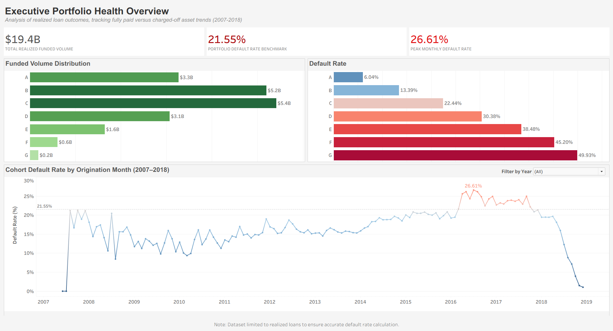
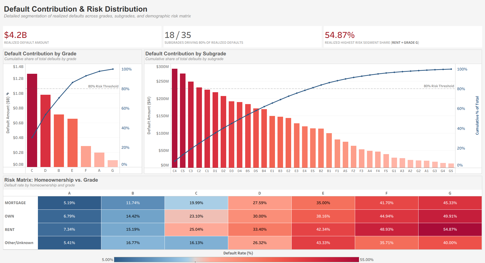
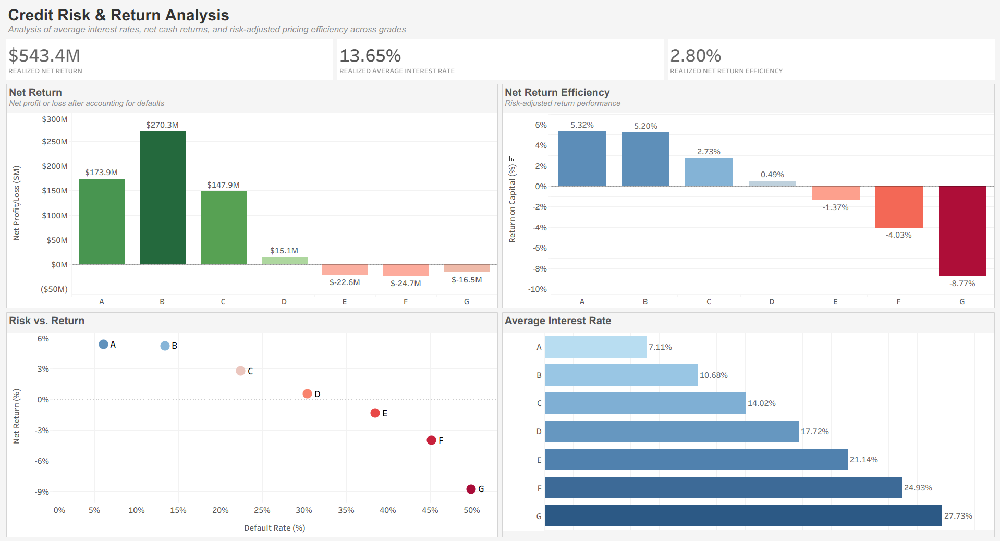
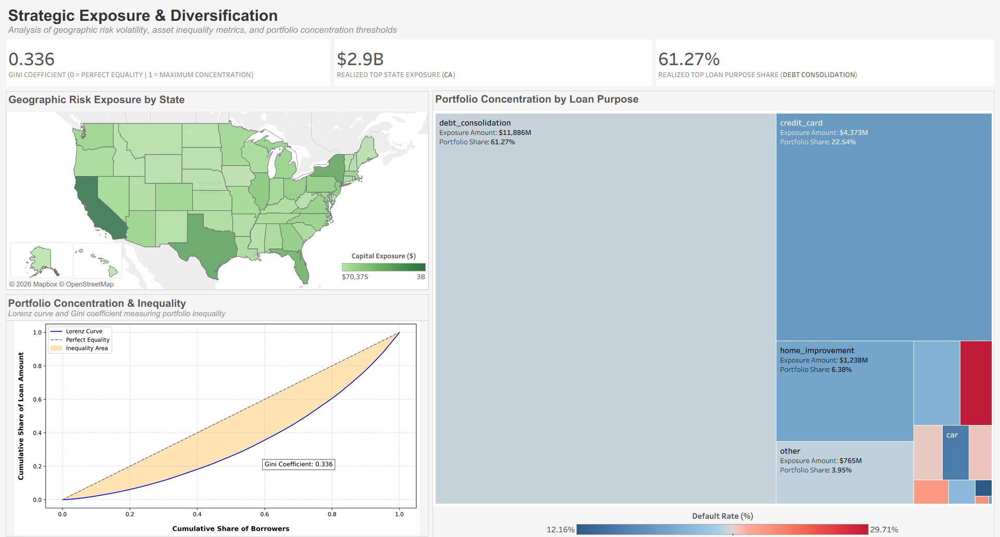
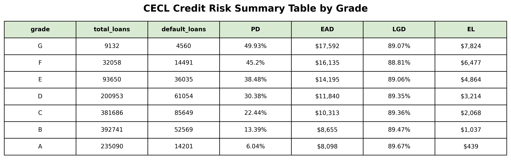
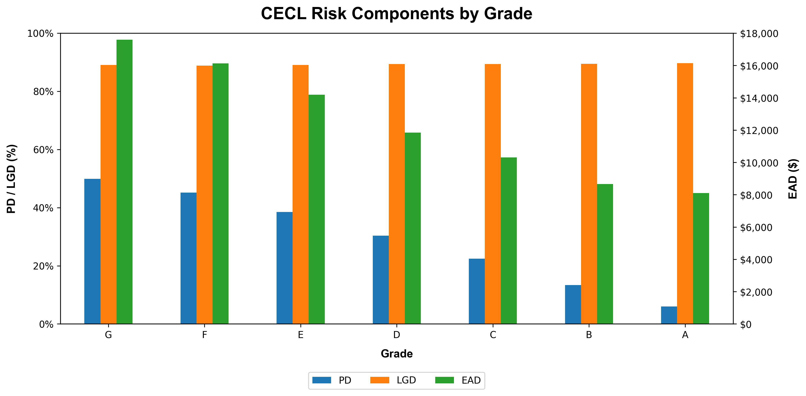
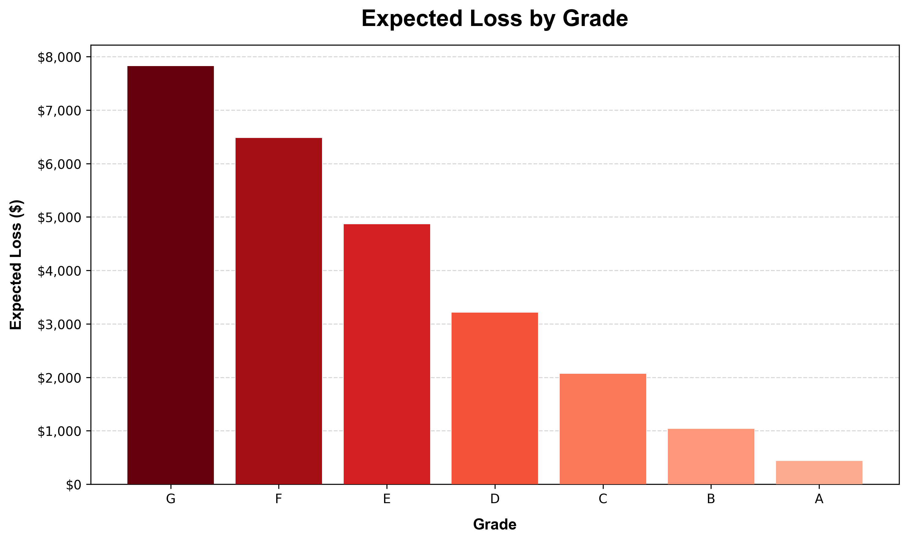

# LendingClub Loan Portfolio Analysis: CECL Credit Risk Modeling, Returns, and Portfolio Concentration


## Overview
This analysis evaluates credit risk, loan performance, and portfolio concentration using over 2.2M loans from the LendingClub dataset (2007–2018). The focus is on approximately 1.3M finalized loans with `Fully Paid` or `Charged Off` status to measure realized portfolio outcomes.

In addition to realized performance metrics, the analysis incorporates a Current Expected Credit Loss (CECL) credit risk framework by estimating Probability of Default (PD), Loss Given Default (LGD), Exposure at Default (EAD), and Expected Loss (EL) across credit grades. This enables forward-looking credit risk measurement alongside historical performance evaluation.

The analysis uses SQL for aggregation, Python for preprocessing and modeling, and Tableau for dashboard development to identify high-risk segments, evaluate risk-adjusted returns, and assess portfolio concentration.

### Key Objectives:
- Analyze portfolio default trends across origination cohorts
- Identify borrower segments contributing most to realized defaults
- Evaluate risk-adjusted returns across credit grades
- Measure portfolio concentration across loan purposes and geographic regions
- Estimate credit risk using a CECL-style framework (PD, LGD, EAD, and EL) across credit grades  

---

## Business Questions

#### 1. Portfolio Health & Default Trends
How does loan performance vary across loan origination cohorts from 2007–2018, and what patterns emerge in portfolio credit risk over time?

#### 2. Default Contribution & Risk Distribution
Which grades contribute most to loan defaults, and how is risk distributed across subgrades and borrower segments?

#### 3. Risk vs. Return Optimization
How does net return performance vary across grades relative to default risk?

#### 4. Portfolio Concentration & Diversification Risk
Is the portfolio heavily concentrated across specific borrower segments or geographic regions?

#### 5. Credit Risk Modeling & Expected Loss (CECL Framework)
How can portfolio credit risk be quantified using Probability of Default (PD), Exposure at Default (EAD), and Loss Given Default (LGD), and how does Expected Loss (EL) vary across borrower grades?

---

## Visual Analytics & Dashboards

This analysis includes both Tableau dashboards and Python-generated credit risk analytics to provide a comprehensive view of portfolio performance.

### Tableau Dashboards

| Dashboard | Description | CSV Files | Preview |
|---|---|---|---|
| **Executive Portfolio Health Overview** | Funded volume distribution, default rate, and cohort default trends | [**exposure_and_default.csv**](data/exposure_and_default.csv)<br>[**default_rate_pct_time.csv**](data/default_rate_pct_time.csv) |  |
| **Default Contribution & Risk Distribution** | Pareto analysis of defaults and borrower risk segmentation | [**default_contribution_pareto.csv**](data/default_contribution_pareto.csv)<br>[**segment_exposure.csv**](data/segment_exposure.csv) |  |
| **Credit Risk & Return Analysis** | Net return, yield efficiency, average interest rate, and risk-return tradeoff analysis | [**return_risk_int.csv**](data/return_risk_int.csv) |  |
| **Strategic Exposure & Diversification** | Geographic exposure, portfolio concentration, Lorenz curve, and Gini coefficient | [**segment_exposure.csv**](data/segment_exposure.csv)<br>[**lorenz_curve.zip**](data/lorenz_curve.zip)<br>[**gini_coefficient.csv**](data/gini_coefficient.csv) |  |

> **Technical Note:** The Lorenz curve and Gini coefficient are computed in Python due to the large dataset size (~1.3M borrowers) and the need for borrower-level cumulative calculations. The resulting visualization is embedded in a Tableau dashboard.

### CECL Credit Risk Analytics (Python)

| Output | Description | Preview |
|---|---|---|
| **CECL Components Table** | Summary of credit risk metrics by grade including PD, LGD, EAD, EL |  |
| **CECL Components Breakdown** | Multi-metric visualization of PD, LGD, and EAD by grade (dual-axis chart)  |  |
| **Expected Loss by Grade** | Expected Loss distribution across grades |  |
---

## Executive Summary

### Portfolio Performance & Risk Metrics

- **Total Funded Volume**: \$19.4B
- **Charged-Off Exposure (Origination Principal)**: \$4.2B
- **Portfolio Default Rate (Charge-Off Rate)**: 21.55%
- **Peak Cohort Default Rate**: 26.61% (July 2016 origination cohort)
- **Risk Concentration (Pareto Analysis)**: 18 of 35 subgrades accounted for 80% of realized defaults
- **Highest Risk Credit Segment**: Renters with Grade G loans - 54.87% default rate
- **Inequality Index**: 0.336 Gini Coefficient
- **Realized Net Return**: \$543.4M
- **Average Portfolio Interest Rate**: 13.65%
- **Net Return Efficiency**: 2.80%
- **Top Loan Purpose Exposure**: Debt Consolidation - 61.27% share, \$11.9B exposure
- **Top State Concentration**: California - $2.9B exposure, 19.6% default rate

### Credit Risk Modeling (CECL Framework) Metrics

- **Total Expected Loss (EL)**: \$25,923 (modeled portfolio credit loss using PD × LGD × EAD framework)
- **Average PD**: 29.41% across borrower grades
- **Average EAD**: \$12,832 per loan across defaulted exposures
- **Average LGD**: 89.1%, indicating high and stable severity of loss upon default
- **PD Range Across Grades**: 6.04% (Grade A) → 49.93% (Grade G)
- **LGD Stability**: 88.8% – 89.7%, showing minimal variation across credit grades
- **Expected Loss Range**: \\$439 (Grade A) → \$7,824 (Grade G), showing strong risk stratification across portfolio

### Key Insights

- **Cohort Default Trends**: Default rates peaked at 26.6% in the July 2016 origination cohort, indicating a period of elevated credit risk and weaker underwriting performance.
- **Default Distribution**: Defaults were broadly distributed across the portfolio, with 18 of 35 subgrades contributing to 80% of total defaults.
- **Highest Risk Segment**: Renters with Grade G loans exhibited the highest observed default rate at 54.9%.
- **Risk vs. Return**: Grades A and B generated the strongest risk-adjusted returns (~5%) while lower grades experienced deteriorating profitability and materially higher default exposure.
- **Portfolio Concentration**: Debt consolidation loans accounted for 61.27% of funded volume, while California represented the largest geographic exposure.
- **Portfolio Inequality**: The Gini coefficient of 0.336 indicates moderate concentration risk across borrower exposure.
- **Credit Risk Modeling (CECL Framework)**: Expected credit loss is primarily driven by variation in PD across credit grades, while LGD remains relatively stable (~89%). EL increases significantly from Grade A (\\$439) to Grade G (\\$7,824), reflecting strong risk stratification. EAD also rises with deteriorating credit quality, amplifying losses in lower-grade segments. Overall, total modeled Expected Loss is \$25,923, indicating concentrated credit risk in subprime grades.

### Business Recommendations

- Implement automated monitoring and back-testing of underwriting models to detect deteriorating loan quality earlier and reduce future default exposure.
- Apply targeted lending restrictions and risk-based pricing for high-risk borrower combinations rather than relying solely on broad credit grade limits.
- Focus origination on Grades A–C, where risk-adjusted returns remain strongest, and tighten underwriting or pricing in lower grades where default risk outweighs yield.
- Diversify lending across loan purposes and geographic regions to reduce concentration risk and improve portfolio resilience.
- Incorporate EL outputs into ongoing portfolio monitoring to proactively identify segments with disproportionate credit risk, particularly Grades E–G where EL is significantly elevated.
- Use CECL-driven expected loss estimates (ranging from \\$439 in Grade A to \\$7,824 in Grade G) as a quantitative input for capital allocation, pricing adjustments, and stress testing scenarios to improve forward-looking risk management.

---

## Analysis Workflow (Dashboard Architecture & CECL Framework)

### Data Preparation
- Data Exploration, Filtering, and Cleaning

### Dashboard 1: Executive Portfolio Health Overview
- Funded Volume Distribution
- Default Rate
- Cohort Default Rate by Origination Month (2007–2018)

### Dashboard 2: Default Contribution & Risk Distribution
- Default Contribution by Grade (Pareto)
- Default Contribution by Subgrade (Pareto)
- Risk Matrix: Homeownership vs. Grade

### Dashboard 3: Credit Risk & Return Analysis
- Net Return
- Net Return Efficiency
- Risk vs. Return
- Average Interest Rate

### Dashboard 4: Strategic Exposure & Diversification
- Geographic Risk Exposure
- Portfolio Concentration & Inequality (Lorenz Curve & Gini Coefficient)
- Portfolio Concentration by Loan Purpose

### Credit Risk Modeling & Expected Loss (CECL Framework)
- PD, EAD, and LGD Estimation
- EL Calculation
- CECL Credit Risk Summary Table
- CECL Risk Components by Grade (plot)
- Expected Loss by Grade (plot)

---

## Technologies Used
- Python (Pandas, NumPy, Matplotlib, SQLAlchemy)
- PostgreSQL
- Tableau Public
- Jupyter Notebook
- Git / GitHub

---

## Data Preparation

- Processed the dataset in 100k-row chunks to manage memory usage efficiently
- Filtered finalized loans (`Fully Paid`, `Charged Off`)
- Selected 22 relevant analytical columns
- Standardized datetime fields
- Handled missing values
- Loaded cleaned data into PostgreSQL for querying and aggregation
- Generated a reproducible 1,000-row sample (`accepted_loans_sample.csv`) for GitHub portability, ensuring notebook runs instantly for reviewers

---

## Technical Skills Demonstrated

### Python
- Data preprocessing
- Memory-efficient chunking
- Missing value handling
- Datetime conversion
- Lorenz curve construction and visualization
- Gini coefficient calculation
- CECL credit risk modeling

### SQL
- CTEs
- Window functions
- Aggregations

### Tableau
- Dashboard development
- KPI visualization

### Analytics Concepts
- Credit risk analysis and modeling (CECL framework: PD, LGD, EAD, EL)  
- Cohort analysis
- Pareto analysis
- Risk-return optimization
- Portfolio concentration analysis
- Loan distribution inequality (Lorenz curve & Gini coefficient)

---

## Repository Structure

```
LendingClub_Loan_Portfolio_Analysis/
|
|-- data/ (CSV outputs used in analysis)
| |-- accepted_loans_sample.csv
| |-- exposure_and_default.csv
| |-- default_rate_pct_time.csv
| |-- default_contribution_pareto.csv
| |-- segment_exposure.csv
| |-- return_risk_int.csv
| |-- lorenz_curve.zip
| |-- gini_coefficient.csv
| |-- cecl_table.csv
|
|-- images/ (Saved dashboards & CECL Components Table/Plots)
| |-- Executive_Portfolio_Health_Overview.png
| |-- Default_Contribution_&_Risk_Distribution.png
| |-- Profitability_&_Yield_Metrics.png
| |-- Strategic_Exposure_&_Diversification.png
| |-- cecl_table.png
| |-- cecl_components.png
| |-- cecl_expected_loss.png

| 
|-- notebook/
| |-- LendingClub_Loan_Portfolio_Analysis.ipynb
|
|-- README.md
```